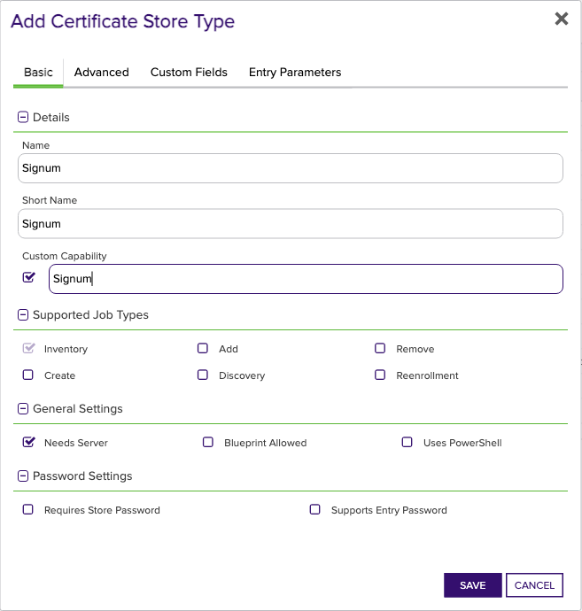
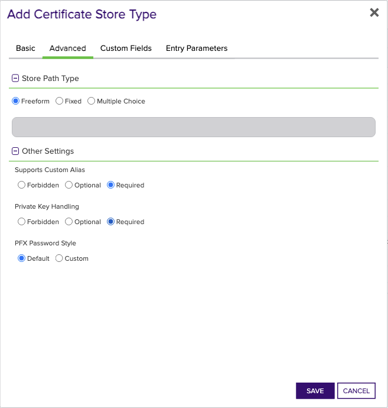
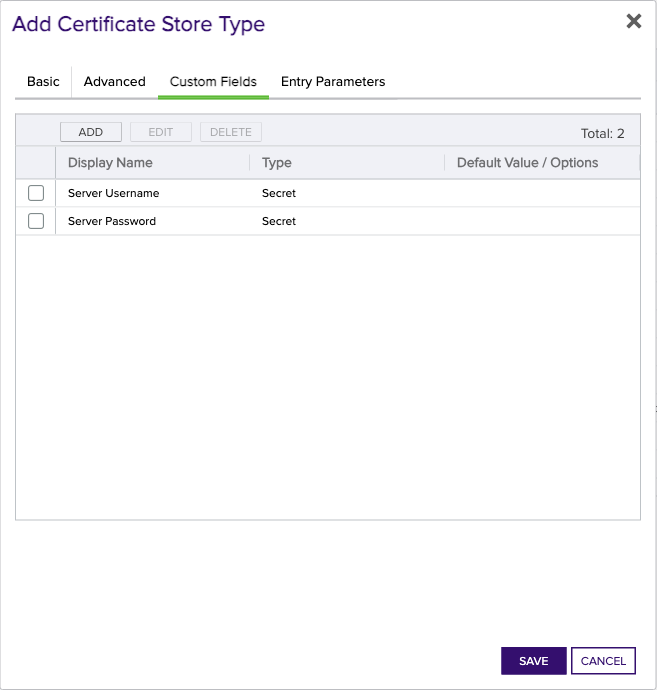

## Signum

The Signum Certificate Store Type in Keyfactor Command is designed to facilitate the management and automation of cryptographic certificates within the Signum platform. Specifically, it defines how certificates are stored, managed, and retrieved from Signum endpoints using the Keyfactor Universal Orchestrator extension.

### What Does the Certificate Store Type Do?
The Certificate Store Type enables Keyfactor Command to interface with the Signum platform, allowing users to perform various certificate management tasks such as inventory, adding, and removing certificates. It streamlines the process of handling certificates, ensuring consistency and reliability in certificate operations.

### What Does It Represent?
In this context, the Certificate Store Type represents a configuration that maps to endpoints within the Signum platform. These endpoints are defined to handle certificates and integrate with the Signum SOAP API for secure communications and operations.

### Caveats
One significant caveat to note is that the integration utilizes Basic Authentication when consuming the Signum SOAP API library. Therefore, it's crucial to ensure that the credentials used possess the appropriate authorization to execute the required Signum SOAP endpoints.

### SDK Usage
The Signum Certificate Store Type does not rely on an SDK. Instead, it uses direct SOAP API calls for its operations. This simplifies the integration but also underscores the importance of accurate endpoint configuration.

### Significant Limitations or Areas for Confusion
There are a few key areas to be aware of:
- The `Store Path` parameter is fixed and hardcoded to `NA`, representing "not applicable."
- The Store relies on a base URL configuration, which typically follows the pattern `https://{base url for your signum install}:8888/rtadminservice.svc/basic`, and uses Basic Authentication only.
- Custom capability is not enabled, limiting flexibility for advanced customizations without altering the base configuration significantly.

Understanding these key points and configuring the Certificate Store Type accordingly will help avoid potential pitfalls and ensure smooth operation within the Signum platform.


### Supported Job Types

| Job Name | Supported |
| -------- | --------- |
| Inventory | ✅ |
| Management Add |  |
| Management Remove |  |
| Discovery |  |
| Create |  |
| Reenrollment |  |

## Requirements

### Signum Orchestrator Extension Installation
1. Create the Signum certificate store type manually in Keyfactor Command by clicking on Settings (the gear icon on the top right) => Certificate Store Types => Add and then entering the settings described in the next section - Certificate Store Type Settings, OR by utilizing the CURL script found under the Certificate Store Type CURL Script folder in this repo. 
2. Stop the Keyfactor Universal Orchestrator Service for the orchestrator you plan to install this extension to run on.
3. In the Keyfactor Orchestrator installation folder (by convention usually C:\Program Files\Keyfactor\Keyfactor Orchestrator), find the "Extensions" folder. Underneath that, create a new folder named "Signum" (you may choose to use a different name if you wish).
4. Download the latest version of the Signum Orchestrator Extension from [GitHub](https://github.com/Keyfactor/signum-orchestrator).  Click on the "Latest" release link on the right hand side of the main page and download the first zip file.
5. Copy the contents of the download installation zip file to the folder created in Step 3.
6. (Optional) If you decide to create the certificate store type with a short name different than the suggested value of "Signum", edit the manifest.json file in the folder you created in step 3, and modify each "ShortName" in each "Certstores.{ShortName}.{Operation}" line with the ShortName you used to create the certificate store type in Keyfactor Command.  If you created it with the suggested value, this step can be skipped.
7. Start the Keyfactor Universal Orchestrator Service.
8. In Keyfactor Command, go to Orchestrators => Management and approve the Keyfactor Orchestrator containing the Signum capability that you just installed by selecting the orchestrator and clicking APPROVE.
&nbsp;  
&nbsp;

### Certificate Store Type Settings
Below are the values you need to enter if you choose to manually create the Signum certificate store type in the Keyfactor Command UI (related to Step 1 of Signum Orchestrator Extension Installation above).  

*Basic Tab:*
- **Name** – Required. The display name you wish to use for the new certificate store type.  Suggested value - Signum
- **ShortName** - Required. Suggested value - Signum.  If you choose to use a different value, please refer to Step 6 under Signum Orchestrator Extension Installation above.
- **Custom Capability** - Unchecked
- **Supported Job Types** - Inventory is the only one that should be checked.
- **Needs Server** - Checked
- **Blueprint Allowed** - Checked if you wish to make use of blueprinting.  Please refer to the Keyfactor Command Reference Guide for more details on this feature.
- **Uses PoserShell** - Unchecked
- **Requires Store Password** - Unchecked.
- **Supports Entry Password** - Unchecked.  

*Advanced Tab:*  
- **Store Path Type** - Fixed (with a value of NA underneath to represent "not applicable")
- **Supports Custom Alias** - Required
- **Private Key Handling** - Required
- **PFX Password Style** - Default  

*Custom Fields Tab:*
None

*Entry Parameters:*
None
&nbsp;  
&nbsp;


## Certificate Store Type Configuration

The recommended method for creating the `Signum` Certificate Store Type is to use [kfutil](https://github.com/Keyfactor/kfutil). After installing, use the following command to create the `` Certificate Store Type:

```shell
kfutil store-types create Signum
```

<details><summary>Signum</summary>

Create a store type called `Signum` with the attributes in the tables below:

### Basic Tab
| Attribute | Value | Description |
| --------- | ----- | ----- |
| Name | Signum | Display name for the store type (may be customized) |
| Short Name | Signum | Short display name for the store type |
| Capability | Signum | Store type name orchestrator will register with. Check the box to allow entry of value |
| Supported Job Types (check the box for each) | Add, Discovery, Remove | Job types the extension supports |
| Supports Add |  |  Indicates that the Store Type supports Management Add |
| Supports Remove |  |  Indicates that the Store Type supports Management Remove |
| Supports Discovery |  |  Indicates that the Store Type supports Discovery |
| Supports Reenrollment |  |  Indicates that the Store Type supports Reenrollment |
| Supports Create |  |  Indicates that the Store Type supports store creation |
| Needs Server | ✅ | Determines if a target server name is required when creating store |
| Blueprint Allowed |  | Determines if store type may be included in an Orchestrator blueprint |
| Uses PowerShell |  | Determines if underlying implementation is PowerShell |
| Requires Store Password |  | Determines if a store password is required when configuring an individual store. |
| Supports Entry Password |  | Determines if an individual entry within a store can have a password. |

The Basic tab should look like this:



### Advanced Tab
| Attribute | Value | Description |
| --------- | ----- | ----- |
| Supports Custom Alias | Required | Determines if an individual entry within a store can have a custom Alias. |
| Private Key Handling | Required | This determines if Keyfactor can send the private key associated with a certificate to the store. Required because IIS certificates without private keys would be invalid. |
| PFX Password Style | Default | 'Default' - PFX password is randomly generated, 'Custom' - PFX password may be specified when the enrollment job is created (Requires the Allow Custom Password application setting to be enabled.) |

The Advanced tab should look like this:



### Custom Fields Tab
Custom fields operate at the certificate store level and are used to control how the orchestrator connects to the remote target server containing the certificate store to be managed. The following custom fields should be added to the store type:

| Name | Display Name | Type | Default Value/Options | Required | Description |
| ---- | ------------ | ---- | --------------------- | -------- | ----------- |


The Custom Fields tab should look like this:




</details>

## Certificate Store Configuration

After creating the `Signum` Certificate Store Type and installing the Signum Universal Orchestrator extension, you can create new [Certificate Stores](https://software.keyfactor.com/Core-OnPrem/Current/Content/ReferenceGuide/Certificate%20Stores.htm?Highlight=certificate%20store) to manage certificates in the remote platform.

The following table describes the required and optional fields for the `Signum` certificate store type.

| Attribute | Description | Attribute is PAM Eligible |
| --------- | ----------- | ------------------------- |
| Category | Select "Signum" or the customized certificate store name from the previous step. | |
| Container | Optional container to associate certificate store with. | |
| Client Machine | For the Client Machine field, enter the base URL used for Signum endpoint calls, formatted as 'https://{base url for your signum install}:8888/rtadminservice.svc/basic'. The port number is generally 8888, but it may vary depending on your Signum configuration. | |
| Store Path | For the Store Path field, enter 'NA' as it is hardcoded to represent 'not applicable' for Signum Certificate Stores. | |
| Orchestrator | Select an approved orchestrator capable of managing `Signum` certificates. Specifically, one with the `Signum` capability. | |

* **Using kfutil**

    ```shell
    # Generate a CSV template for the AzureApp certificate store
    kfutil stores import generate-template --store-type-name Signum --outpath Signum.csv

    # Open the CSV file and fill in the required fields for each certificate store.

    # Import the CSV file to create the certificate stores
    kfutil stores import csv --store-type-name Signum --file Signum.csv
    ```

* **Manually with the Command UI**: In Keyfactor Command, navigate to Certificate Stores from the Locations Menu. Click the Add button to create a new Certificate Store using the attributes in the table above.